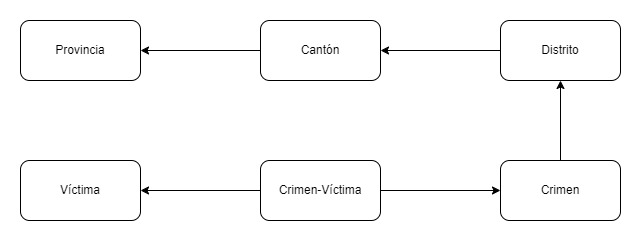

# About

## Database management system

> [SQLite](https://sqlite.org/index.html) is a C-language library that implements a small, fast, self-contained, high-reliability, full-featured, SQL database engine.

## Entities and attributes

### [Provincia](https://en.wikipedia.org/wiki/Provinces_of_Costa_Rica) (province)

| Attribute        | Type    | Description                    |
|------------------|---------|--------------------------------|
| id_provincia     | INTEGER | Primary key, unique identifier |
| nombre_provincia | TEXT    | Name of the province           |

### [Cantón](https://en.wikipedia.org/wiki/Cantons_of_Costa_Rica) (canton)

| Attribute     | Type    | Description                                   |
|---------------|---------|-----------------------------------------------|
| id_canton     | INTEGER | Primary key, unique identifier                |
| nombre_canton | TEXT    | Name of the canton                            |
| id_provincia  | INTEGER | Foreign key, id of the province it belongs to |

### [Distrito](https://en.wikipedia.org/wiki/Districts_of_Costa_Rica) (district)	

| Attribute       | Type    | Description                                 |
|-----------------|---------|---------------------------------------------|
| id_distrito     | INTEGER | Primary key, unique identifier              |
| nombre_distrito | TEXT    | Name of the district                        |
| id_canton       | INTEGER | Foreign key, id of the canton it belongs to |

## Crimen (crime)

| Attribute   | Type    | Description                                    |
|-------------|---------|------------------------------------------------|
| id_crimen   | INTEGER | Primary key, unique identifier (autoincrement) |
| tipo        | TEXT    | Type of crime                                  |
| descripcion | TEXT    | Description of the crime                       |
| fecha       | DATE    | Date of the crime                              |
| id_distrito | INTEGER | Foreign key, id of the district it occurred in |

## Víctima (victim)

| Attribute    | Type    | Description                                    |
|--------------|---------|------------------------------------------------|
| id_victima   | INTEGER | Primary key, unique identifier (autoincrement) |
| tipo         | TEXT    | Type of victim                                 |
| descripcion  | TEXT    | Description of the victim                      |
| grupo_etario | TEXT    | Age group of the victim                        |
| nacionalidad | TEXT    | Nationality of the victim                      |

## Crimen-Víctima (crime-victim)

| Attribute  | Type    | Description                                 |
|------------|---------|---------------------------------------------|
| id_crimen  | INTEGER | Foreign key, id of the crime it belongs to  |
| id_victima | INTEGER | Foreign key, id of the victim it belongs to |

> Pending: maybe store KML polygons in the database?

## Relationships

- A: N to N
- B: N to 1
- C: 1 to N
- D: 1 to 1
- E: None or not directly related

| _Relationships_ | Provincia | Cantón | Distrito | Crimen | Víctima |
|-----------------|-----------|--------|----------|--------|---------|
| Provincia       | -         | C      | E        | E      | E       |
| Cantón          | B         | -      | C        | E      | E       |
| Distrito        | E         | B      | -        | C      | E       |
| Crimen          | E         | E      | B        | -      | D       |
| Víctima         | E         | E      | E        | D      | -       |

## Relational schema

# Cleaned dataset

Isaac PM. (2023). _Crime data in Costa Rica: years 2020 to 2022._ Retrieved from: https://www.kaggle.com/datasets/isaacpm21/crime-data-in-costa-rica-years-2020-to-2022